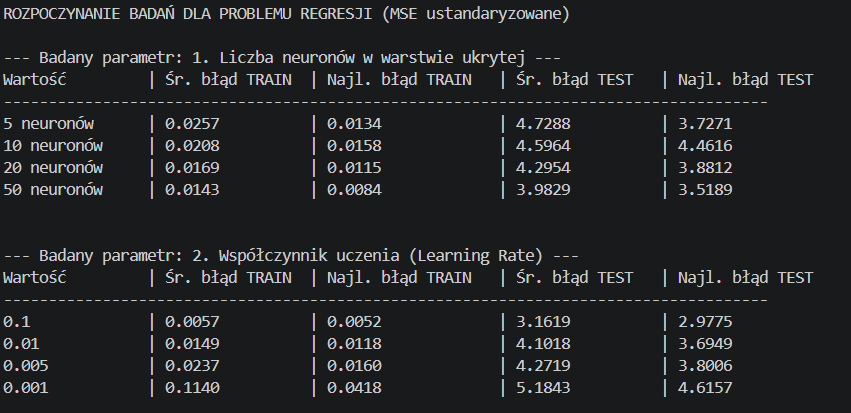
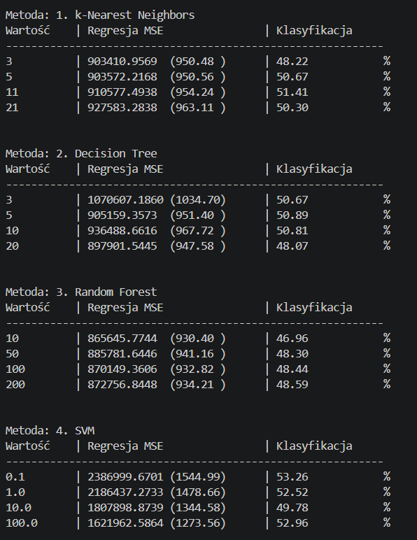
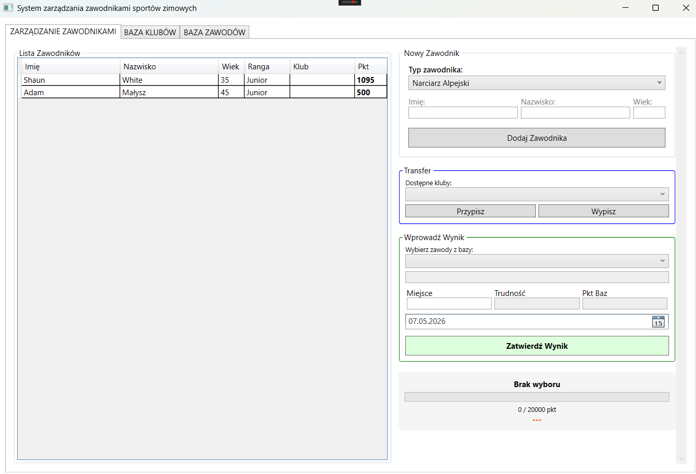
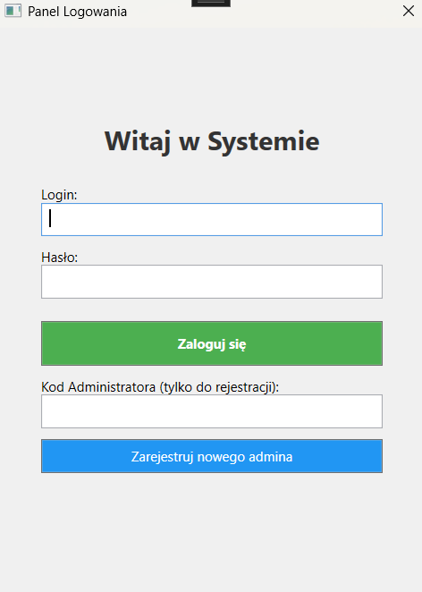

# Hi, I'm Filip Zuziak
**Developer | Data Analyst**

Welcome to my portfolio! This repository showcases my diverse programming projects, demonstrating my skills across multiple technologies. My work ranges from designing software architecture and building UI to developing custom machine learning models and performing exploratory data analysis.

### Tech Stack & Core Skills
* **Languages:** Python, C#, C++, R
* **Technologies & Frameworks:** WPF, .Net, NumPy, Scikit-Learn, Raylib, Pandas 
* **Key Competencies:** Object-Oriented Programming, Web Development, Machine Learning, Data Visualization, Data Analysis

---

## Featured Projects

### [XAU/USD Market Prediction: Custom Neural Networks & Classic ML](<./Custom Neural Networks & Classic ML>)
A comprehensive machine learning project focused on predicting gold market prices and trend directions. The primary objective was a deep exploration of ML algorithms by building a Multi-Layer Perceptron.
* **Tech Stack:** `Python`, `NumPy`, `Scikit-Learn`
* A neural network built directly on NumPy matrices, covering the forward pass, backpropagation, and weight updates, with a choice of sigmoid, ReLU, or tanh activations. Trained on gold XAU/USD data for two tasks: regression, which predicts the next-day price, and classification, which predicts direction, whether the price goes up or down.

The script tests one parameter at a time around a fixed baseline configuration, including `neuron count`, `learning rate`, `number of epochs`, `activation function`, `train/test split`, and `number of hidden layers`, to see how each one affects performance.

*Console output shown below: (for the regression task)*

Each table corresponds to one tested parameter, with each row showing a different value tried. The network is trained five times per value, since weights start randomly, and the columns report the average and best error on both the training set and the test set. `Błąd TRAIN` reflects how well the network fits data it has already seen, while `Błąd TEST` reflects performance on unseen data, which is the more meaningful measure of real-world accuracy. Both errors are mean squared error computed on the standardized target, meaning the price is scaled to zero mean and unit variance before the error is calculated, so the values reflect relative deviation rather than dollar amounts.

> **Model Training Results (Regression Analysis):**
> 

Second part swaps in scikit-learn's built-in models on the same regression and classification setup, to compare against tuned, ready-made implementations. Each method has its own core parameter being tested: `number of neighbors` for **kNN**, `maximum tree depth` for **Decision Tree**, `number of trees` for **Random Forest**, and the `regularization strength C` for **SVM**.

*Console output shown below:*

The `Regresja MSE` column reports mean squared error for the regression task, with RMSE shown in parentheses since it's in the same units as the price and easier to interpret directly. The `Klasyfikacja` column reports classification accuracy, the percentage of correctly predicted price directions.

> **Model Training Results (scikit-learn):**
> 
> 

### [Athlete Management System](<./Athlete Management System>)
A multi-layered desktop application designed for managing winter sports athletes, highlighting a professional approach to software engineering and robust architecture.
* **Tech Stack:** `C#`, `WPF`, `.NET`

A desktop application for organizations running winter sports competitions, built to handle athletes, clubs, and competition results in one place. Admins log in through a dedicated authentication system and manage everything from there.

The system covers the full structure of running a competition. Admins can create competitions, register athletes, and set up clubs, then assign athletes to the clubs they belong to. Each club has its own entry requirements, including a minimum point threshold an athlete needs to join, a maximum age limit, and a cap on how many athletes it can hold. Competitions have their own settings too, with a difficulty level on a scale from one to five and a points system based on final placement.

Once a competition takes place, admins record each athlete's result, which feeds back into their overall point total and determines whether they meet the requirements for higher level clubs.

> **Application Interface (Main Dashboard & Login):**
> 
> 

---

## Data Analysis & Utilities

### [Exploratory Data Analysis (EDA)](<./EDA Analysis>)
An Exploratory Data Analysis project focused on statistical data processing and insights generation.
* **Tech Stack:** `R`, `ggplot2`
* **Description:** Showcases the ability to handle datasets, perform complex data cleaning, and generate informative statistical plots to uncover hidden patterns and trends.

### [Lorenz Curve & Gini Coefficient Calculator](<./Lorenz Curve>)
A Python utility application that automates economic data analysis based on spreadsheet inputs.
* **Tech Stack:** `Python`, `GUI Library`, `Pandas / Openpyxl`
* **Description:** Parses `.xlsx` files to plot the Lorenz curve and precisely calculate the Gini coefficient. The application features a graphical user interface for seamless input file selection.

### [Log & Text Analysis Tool](<./Text Analysis>)
A robust Python script designed for data validation and text file processing.
* **Tech Stack:** `Python`
* **Description:** Automatically scans files to filter correct lines of text while catching erroneous data, printing detailed information about the error types directly to the console.

---

##  Game Development

###  [Tetris Clone](./Tetris)
A classic Tetris implementation built to master memory management, game loops, and project structuring.
* **Tech Stack:** `C++`, `Raylib`
* **Description:** Developed with a modular approach, separating logic into headers and source files, and cleanly managing assets like music and custom fonts.

###  [Pong Game](<./Pong>)
### [Snake Game](<./Snake Game>)
Implementations of foundational arcade games focusing on core logic, user input processing, and real-time rendering.
* **Pong:** Written in `C++` using the `Raylib` framework. Features a Player vs. Computer mode with basic AI paddle mechanics.
* **Snake:** Written in `Python` utilizing the built-in `turtle` graphics library.

